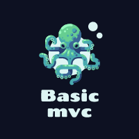

<a name="readme-top"></a>

[![Contributors][contributors-shield]][contributors-url]
[![Forks][forks-shield]][forks-url]
[![Stargazers][stars-shield]][stars-url]
[![Issues][issues-shield]][issues-url]
[![MIT License][license-shield]][license-url]
[![LinkedIn][linkedin-shield]][linkedin-url]


<!-- PROJECT LOGO -->
<br />
<div align="center">
  <a href="https://github.com/sagiweizmann/BasicMVC">
    
  </a>

<h3 align="center">Basic MVC Template</h3>

  <p align="center">
    Just another PHP MVC basic template to work with
    <br />
    <a href="https://github.com/sagiweizmann/BasicMVC"><strong>Explore the docs »</strong></a>
    <br />
    <br />
    <a href="https://github.com/sagiweizmann/BasicMVC">View Demo</a>
    ·
    <a href="https://github.com/sagiweizmann/BasicMVC/issues">Report Bug</a>
    ·
    <a href="https://github.com/sagiweizmann/BasicMVC/issues">Request Feature</a>
  </p>
</div>


<!-- TABLE OF CONTENTS -->
<details>
  <summary>Table of Contents</summary>
  <ol>
    <li>
      <a href="#about-the-project">About The Project</a>
      <ul>
        <li><a href="#built-with">Built With</a></li>
      </ul>
    </li>
    <li>
      <a href="#getting-started">Getting Started</a>
      <ul>
        <li><a href="#prerequisites">Prerequisites</a></li>
        <li><a href="#installation">Installation</a></li>
      </ul>
    </li>
    <li><a href="#contributing">Contributing</a></li>
    <li><a href="#license">License</a></li>
    <li><a href="#contact">Contact</a></li>
  </ol>
</details>


<!-- ABOUT THE PROJECT -->
## About The Project

Just a Basic MVC Pattern written in PHP

<p align="right">(<a href="#readme-top">Back to top</a>)</p>


### Built With

* [![PHP][PHP]][PHP-url]

<p align="right">(<a href="#readme-top">Back to top</a>)</p>


<!-- GETTING STARTED -->
## Getting Started

This is an example of how you may give instructions on setting up your project locally.
To get a local copy up and running follow these simple example steps.

### Prerequisites

You will need the following items:
* XAMPP (or another apache lamp stack)
* MySQL
* PHP 7.4+

### Installation

1. Clone the repo
   ```sh
   git clone https://github.com/sagiweizmann/BasicMVC.git
   ```
2. Enter your MySQL Details in `config/config.php`
 
3. Run the app

<p align="right">(<a href="#readme-top">Back to top</a>)</p>


<!-- CONTRIBUTING -->
## Contributing

Contributions are what make the open source community such an amazing place to learn, inspire, and create. Any contributions you make are **greatly appreciated**.

If you have a suggestion that would make this better, please fork the repo and create a pull request. You can also simply open an issue with the tag "enhancement".
Don't forget to give the project a star! Thanks again!

1. Fork the Project
2. Create your Feature Branch (`git checkout -b feature/AmazingFeature`)
3. Commit your Changes (`git commit -m 'Add some AmazingFeature'`)
4. Push to the Branch (`git push origin feature/AmazingFeature`)
5. Open a Pull Request

<p align="right">(<a href="#readme-top">Back to top</a>)</p>


<!-- LICENSE -->
## License

Distributed under the MIT License. See `LICENSE.txt` for more information.

<p align="right">(<a href="#readme-top">Back to top</a>)</p>


<!-- CONTACT -->
## Contact

Sagi Weizmann - sagiweizmann@gmail.com

Project Link: [https://github.com/sagiweizmann/BasicMVC](https://github.com/sagiweizmann/BasicMVC)

<p align="right">(<a href="#readme-top">Back to top</a>)</p>


<!-- MARKDOWN LINKS & IMAGES -->
<!-- https://www.markdownguide.org/basic-syntax/#reference-style-links -->
[contributors-shield]: https://img.shields.io/github/contributors/sagiweizmann/BasicMVC.svg?style=for-the-badge
[contributors-url]: https://github.com/sagiweizmann/BasicMVC/graphs/contributors
[forks-shield]: https://img.shields.io/github/forks/sagiweizmann/BasicMVC.svg?style=for-the-badge
[forks-url]: https://github.com/sagiweizmann/BasicMVC/network/members
[stars-shield]: https://img.shields.io/github/stars/sagiweizmann/BasicMVC.svg?style=for-the-badge
[stars-url]: https://github.com/sagiweizmann/BasicMVC/stargazers
[issues-shield]: https://img.shields.io/github/issues/sagiweizmann/BasicMVC.svg?style=for-the-badge
[issues-url]: https://github.com/sagiweizmann/BasicMVC/issues
[license-shield]: https://img.shields.io/github/license/sagiweizmann/BasicMVC.svg?style=for-the-badge
[license-url]: https://github.com/sagiweizmann/BasicMVC/blob/master/LICENSE.txt
[linkedin-shield]: https://img.shields.io/badge/-LinkedIn-black.svg?style=for-the-badge&logo=linkedin&colorB=555
[linkedin-url]: https://www.linkedin.com/in/sagiweizmann/
[product-screenshot]: images/screenshot.png
[PHP]: https://img.shields.io/badge/PHP7-4f5b93?style=for-the-badge&logo=php&logoColor=white
[PHP-url]: https://www.php.net/
